# Project Habibi — Design System 2.0

> **A comprehensive developer reference for building AI agent interfaces on Nexus.**
> Extracted from the Figma Design System 2.0 — `Project Habibi Components` page.

| Detail | Value |
|---|---|
| **Font (UI)** | Inter |
| **Font (Brand)** | Unilever Desire |
| **Framework** | React + Tailwind CSS |
| **Base Unit** | 16px (1rem) |
| **Source** | [Figma File](https://www.figma.com/design/qafioCr7GiesyZtf90byDh/Design-System-2.0?node-id=339-11336) |

---

## Table of Contents

- [Color System](#color-system)
- [Typography Scale](#typography-scale)
- [Spacing System](#spacing-system)
- [Buttons](#buttons)
- [UI Templates by Agent Type](#ui-templates-by-agent-type)
  - [Template 1 — AI Analytics Chat Agent](#template-1--ai-analytics-chat-agent)
  - [Template 2 — Component Showcase](#template-2--component-showcase)
  - [Template 3 — Landing / Marketing Pages](#template-3--landing--marketing-pages)
  - [Template 4 — Product Information / INCI Agent](#template-4--product-information--inci-agent)
  - [Template 5 — Marketing Chat (Ideas)](#template-5--marketing-chat-ideas)
- [Cards (Shared Components)](#cards-shared-components)
- [Inputs, Badges & Widgets](#inputs-badges--widgets)
- [Modals & Dialogs](#modals--dialogs)
- [Tailwind Config](#tailwind-config)
- [Quick Cheat Sheet](#quick-cheat-sheet)

---

## Color System

The color system is split into **Primary Colors** (used for the majority of the UI) and **Secondary Colors** (used sparingly for accents, pills, alerts, and labels). Each color family uses a **25–900 shade scale** where lower numbers are lighter and higher numbers are darker.

**How to read the scale:**
- **25–100:** Backgrounds, subtle fills, hover states on light surfaces
- **200–300:** Borders, dividers, disabled states
- **400–500:** Icons, secondary text, mid-emphasis elements
- **600–700:** Primary interactive elements (buttons, links, focused inputs)
- **800–900:** High-contrast text, dark headers, darkest backgrounds

### Primary Colors

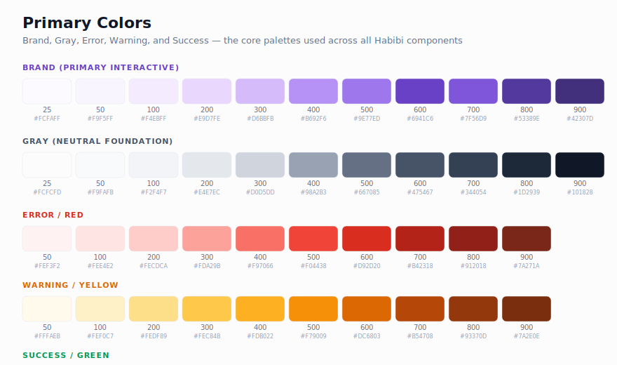

#### Brand (Purple) — Primary Interactive Color

Used across **all interactive elements**: buttons, links, inputs, focus rings, active states.

| Token | Hex | Tailwind | Usage |
|---|---|---|---|
| `brand-25` | `#FCFAFF` | `bg-brand-25` | Lightest bg hover |
| `brand-50` | `#F9F5FF` | `bg-brand-50` | Selected row, subtle highlight |
| `brand-100` | `#F4EBFF` | `bg-brand-100` | Light badge/pill bg |
| `brand-200` | `#E9D7FE` | `border-brand-200` | Light border, focus ring tint |
| `brand-300` | `#D6BBFB` | `border-brand-300` | Active border state |
| `brand-400` | `#B692F6` | `text-brand-400` | Placeholder text, disabled icon |
| `brand-500` | `#9E77ED` | `bg-brand-500` | Mid-emphasis buttons, icons |
| `brand-600` | `#6941C6` | `bg-brand-600` | **Primary button fill**, links |
| `brand-700` | `#7F56D9` | `bg-brand-700` | Button hover, active links |
| `brand-800` | `#53389E` | `text-brand-800` | Dark emphasis text |
| `brand-900` | `#42307D` | `text-brand-900` | Headings on light bg |

```jsx
// Primary Button
<button className="bg-brand-600 hover:bg-brand-700 text-white px-4 py-2 rounded-lg font-semibold">
  Approve Plan
</button>

// Subtle Badge
<span className="bg-brand-50 text-brand-700 px-2 py-1 rounded-full text-sm">Active</span>
```

#### Gray — Neutral Foundation

The backbone of UI design. Used for text, form fields, backgrounds, dividers, borders.

| Token | Hex | Tailwind | Usage |
|---|---|---|---|
| `gray-25` | `#FCFCFD` | `bg-gray-25` | Page bg (lightest) |
| `gray-50` | `#F9FAFB` | `bg-gray-50` | Card bg, table row alt |
| `gray-100` | `#F2F4F7` | `bg-gray-100` | Input bg, sidebar bg |
| `gray-200` | `#E4E7EC` | `border-gray-200` | Default borders, dividers |
| `gray-300` | `#D0D5DD` | `border-gray-300` | Input borders |
| `gray-400` | `#98A2B3` | `text-gray-400` | Placeholder text |
| `gray-500` | `#667085` | `text-gray-500` | Supporting text, labels |
| `gray-600` | `#475467` | `text-gray-600` | Body text (secondary) |
| `gray-700` | `#344054` | `text-gray-700` | Body text (primary) |
| `gray-800` | `#1D2939` | `text-gray-800` | Headings |
| `gray-900` | `#101828` | `text-gray-900` | Display text, highest contrast |

#### Error / Red

Destructive actions, validation errors, critical alerts.

| Token | Hex | Key Usage |
|---|---|---|
| `error-50` | `#FEF3F2` | Error bg |
| `error-300` | `#FDA29B` | Error input border |
| `error-500` | `#F04438` | Destructive button |
| `error-600` | `#D92D20` | Destructive hover |
| `error-700` | `#B42318` | Error text |

#### Warning / Yellow-Orange

Caution, pending states, non-critical alerts.

| Token | Hex | Key Usage |
|---|---|---|
| `warning-50` | `#FFFAEB` | Warning bg |
| `warning-300` | `#FEC84B` | Warning border |
| `warning-500` | `#F79009` | Warning indicator |
| `warning-700` | `#B54708` | Warning text |

#### Success / Green

Confirmation, completion, positive outcomes.

| Token | Hex | Key Usage |
|---|---|---|
| `success-50` | `#ECFDF3` | Success bg |
| `success-500` | `#12B76A` | Active pill |
| `success-600` | `#039855` | Success text |
| `success-700` | `#027A48` | Dark success |

### Secondary Colors

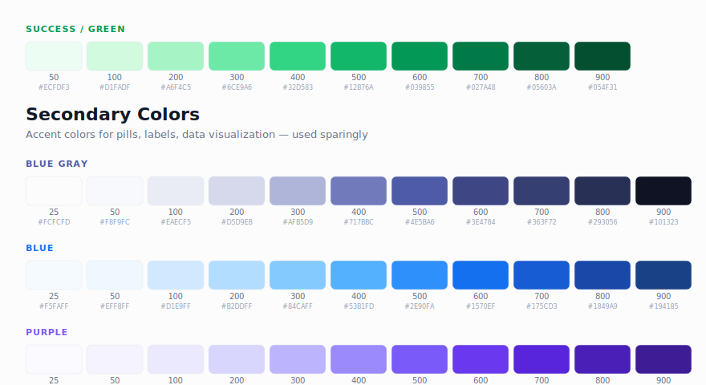

Secondary palettes (Blue Gray, Blue, Purple) are used for accent pills, data visualization, category indicators, and anywhere you need color variety without overriding the primary brand.

| Palette | Key Shades | Primary Use |
|---|---|---|
| **Blue Gray** | `#4E5BA6` (500), `#101323` (900) | Text labels, dark theme backgrounds |
| **Blue** | `#2E90FA` (500), `#1570EF` (600) | Charts, info badges, annotation labels |
| **Purple** | `#7A5AF8` (500), `#6938EF` (600) | Accent interactive, category tags |

---

## Typography Scale

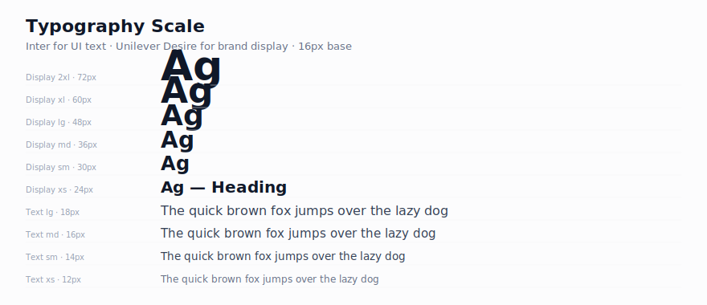

**Primary Font:** `Inter` (UI, body, all functional text)
**Brand Font:** `Unilever Desire` (display headings, marketing copy)

### Display Sizes

| Token | Size | Weight | Line Height | Tailwind |
|---|---|---|---|---|
| Display 2xl | 72px | 700 | 90px | `text-7xl font-bold` |
| Display xl | 60px | 700 | 72px | `text-6xl font-bold` |
| Display lg | 48px | 700 | 60px | `text-5xl font-bold` |
| Display md | 36px | 600 | 44px | `text-4xl font-semibold` |
| Display sm | 30px | 600 | 38px | `text-3xl font-semibold` |
| Display xs | 24px | 600 | 32px | `text-2xl font-semibold` |

### Body / Functional Text

| Token | Size | Weight | Line Height | Tailwind |
|---|---|---|---|---|
| Text xl | 20px | 400/600 | 30px | `text-xl` |
| Text lg | 18px | 400/600 | 28px | `text-lg` |
| Text md | 16px | 400/600 | 24px | `text-base` |
| Text sm | 14px | 400/600 | 20px | `text-sm` |
| Text xs | 12px | 400/600 | 18px | `text-xs` |

```jsx
{/* Page heading */}
<h1 className="font-['Unilever_Desire'] text-4xl font-bold text-gray-900 tracking-tight">
  Dashboard Overview
</h1>

{/* Section heading */}
<h2 className="text-2xl font-semibold text-gray-900">Agent Performance</h2>

{/* Body text */}
<p className="text-base text-gray-700 leading-6">Standard paragraph text.</p>

{/* Caption */}
<span className="text-xs text-gray-500">Last updated: 2 hours ago</span>
```

---

## Spacing System

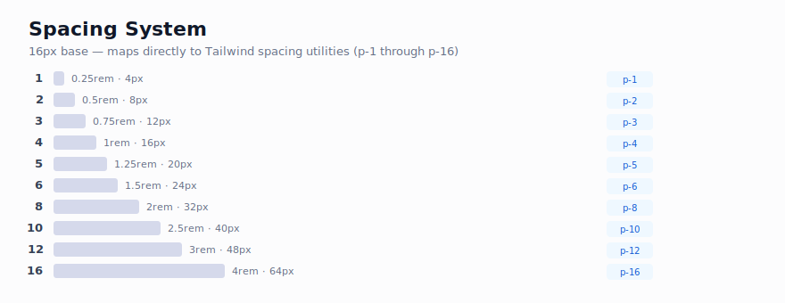

The spacing system uses a **16px base** and maps 1:1 with default Tailwind spacing utilities.

| Name | Rem | Pixels | Tailwind | Common Usage |
|---|---|---|---|---|
| 1 | 0.25rem | 4px | `p-1` / `gap-1` | Inline icon gap |
| 2 | 0.5rem | 8px | `p-2` / `gap-2` | Compact gap |
| 3 | 0.75rem | 12px | `p-3` / `gap-3` | Button padding-x, badge padding |
| 4 | 1rem | 16px | `p-4` / `gap-4` | **Default internal padding** |
| 5 | 1.25rem | 20px | `p-5` / `gap-5` | Medium padding |
| 6 | 1.5rem | 24px | `p-6` / `gap-6` | **Default card padding** |
| 8 | 2rem | 32px | `p-8` / `gap-8` | Large internal spacing |
| 10 | 2.5rem | 40px | `p-10` / `gap-10` | Widget separation |
| 12 | 3rem | 48px | `p-12` / `gap-12` | Panel section breaks |
| 16 | 4rem | 64px | `p-16` / `gap-16` | **Major section dividers** |
| 20 | 5rem | 80px | `py-20` | Page section padding |
| 24 | 6rem | 96px | `py-24` | Hero section padding |
| 32–64 | 8–16rem | 128–256px | — | Full layout offsets |

### When to Use What

**Inside a component** (card, button, input): Tight 4–8px for icon gaps, Default 12–16px for padding, Roomy 20–24px for card internals.

**Between components** (sections, groups): Tight 8–16px for stacked fields, Default 24–32px for grid cards, Spacious 48–64px for page sections.

```jsx
<div className="p-6 space-y-4">            {/* 24px padding, 16px gap */}
  <div className="flex items-center gap-3">  {/* 12px icon-to-text */}
    <Icon />
    <h3 className="text-lg font-semibold">Title</h3>
  </div>
  <p className="text-sm text-gray-500">Description</p>
</div>
```

---

## Buttons

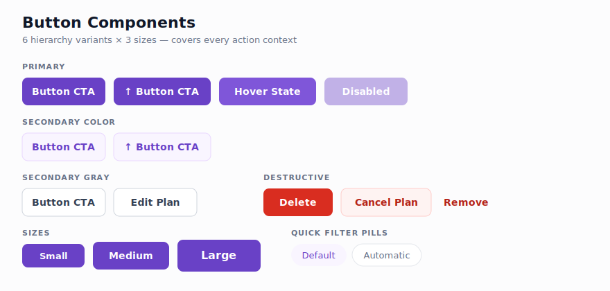

### Button Variants

| Variant | Style | When to Use |
|---|---|---|
| **Primary** | `bg-brand-600` solid, white text | Main CTA — one per section max |
| **Secondary Color** | `bg-brand-50` light fill, `text-brand-700` | Supporting action |
| **Secondary Gray** | White bg, `border-gray-300` | Neutral action |
| **Tertiary Color** | No bg, `text-brand-700` | Low-emphasis, in-context links |
| **Tertiary Gray** | No bg, `text-gray-500` | Cancel, dismiss |
| **Destructive** | `bg-error-600` solid, white text | Delete, deactivate, remove |

### Sizes

| Size | Padding | Font | Tailwind |
|---|---|---|---|
| sm | `px-3 py-2` | 14px | `px-3 py-2 text-sm` |
| md | `px-4 py-2.5` | 14px | `px-4 py-2.5 text-sm` |
| lg | `px-4 py-2.5` | 16px | `px-4 py-2.5 text-base` |

### States

| State | Rule |
|---|---|
| Hover | Darken bg one shade (600→700) |
| Focus | `ring-4 ring-brand-100` |
| Disabled | `opacity-50 cursor-not-allowed` |

### React Component Pattern

```jsx
const variants = {
  primary:        'bg-brand-600 text-white hover:bg-brand-700 focus:ring-4 focus:ring-brand-100',
  secondaryColor: 'bg-brand-50 text-brand-700 hover:bg-brand-100 border border-brand-200',
  secondaryGray:  'bg-white border border-gray-300 text-gray-700 hover:bg-gray-50 shadow-xs',
  tertiaryColor:  'text-brand-700 hover:bg-brand-50',
  tertiaryGray:   'text-gray-500 hover:bg-gray-50 hover:text-gray-700',
  destructive:    'bg-error-600 text-white hover:bg-error-700 focus:ring-4 focus:ring-error-100',
};

const sizes = {
  sm: 'px-3 py-2 text-sm gap-2 rounded-lg',
  md: 'px-4 py-2.5 text-sm gap-2 rounded-lg',
  lg: 'px-4 py-2.5 text-base gap-2 rounded-lg',
};

function Button({ variant = 'primary', size = 'md', children, ...props }) {
  return (
    <button
      className={`inline-flex items-center justify-center font-semibold transition-colors
        ${variants[variant]} ${sizes[size]}
        disabled:opacity-50 disabled:cursor-not-allowed`}
      {...props}
    >
      {children}
    </button>
  );
}
```

---

## UI Templates by Agent Type

The Project Habibi Components page contains **5 distinct UI template groups**, each designed for a different AI agent workflow. Every template exists in **light and dark mode** variants and shares the same underlying component library (sidebar, top nav, chat input, charts, cards, tool calls, toasts).

---

### Template 1 — AI Analytics Chat Agent

> The core template. A full-screen chat interface with sidebar, conversation history, inline analytics generation, and tool call status cards. This is the primary UI pattern for building Nexus agents.

**Variants in Figma:** Light mode, Dark mode, Minimal sidebar, "Back to Showcase" breadcrumb versions

#### Light Mode

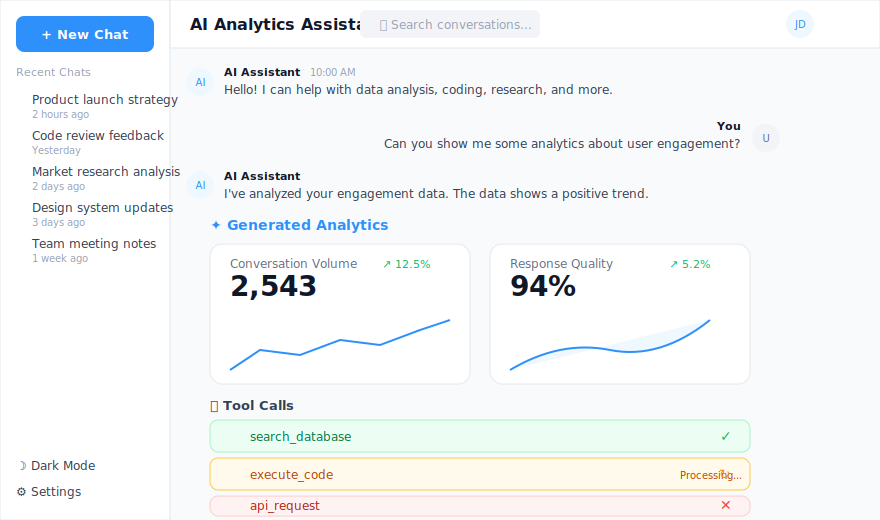

#### Dark Mode

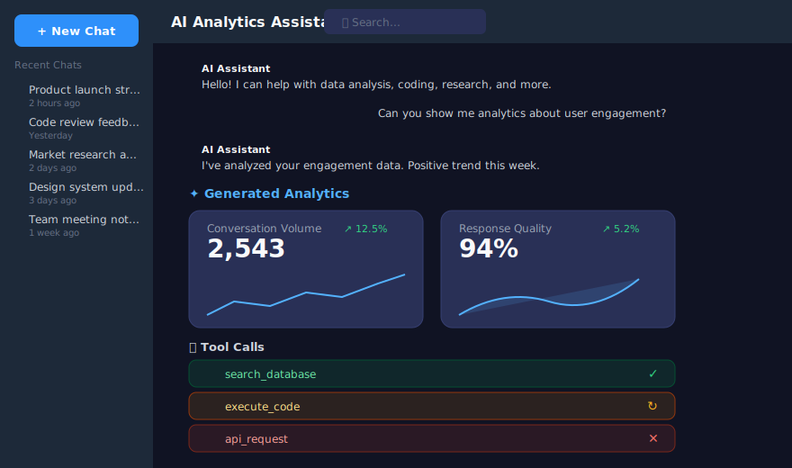

#### Welcome / Empty State

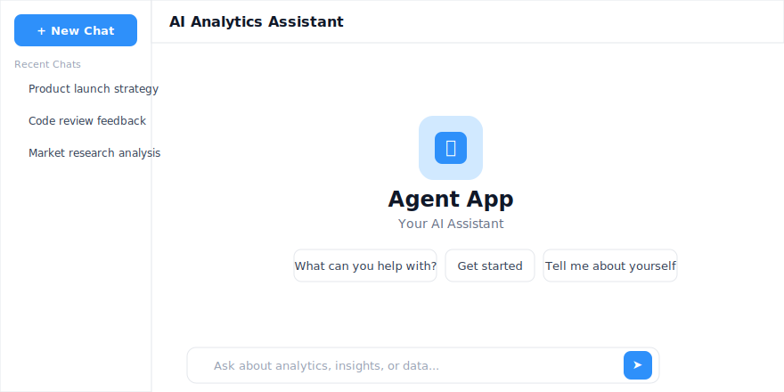

#### Key Components in This Template

| Component | Description | Tailwind Pattern |
|---|---|---|
| **Left Sidebar** | Chat history list + New Chat CTA | `w-[170px] bg-white border-r border-gray-200` (dark: `bg-gray-800`) |
| **Top Navigation Bar** | Agent name + search + user avatar | `h-12 bg-white border-b flex items-center px-4` |
| **Chat Message (AI)** | Avatar + name + timestamp + response + feedback icons | `flex gap-3`, avatar is `w-7 h-7 rounded-full bg-blue-50` |
| **Chat Message (User)** | Right-aligned message + avatar | `flex flex-row-reverse gap-3` |
| **Generated Analytics Cards** | Stat + chart in a bordered card, inline in chat | `border border-gray-200 rounded-xl p-5` |
| **Tool Call — Success** | Green bg, check icon | `bg-success-50 border border-success-200 rounded-lg px-4 py-3` |
| **Tool Call — Processing** | Yellow/amber bg, spinner | `bg-warning-50 border border-warning-200 rounded-lg px-4 py-3` |
| **Tool Call — Error** | Red bg, X icon | `bg-error-50 border border-error-200 rounded-lg px-4 py-3` |
| **Chat Input** | Attachment + mic + send button | `border border-gray-200 rounded-xl`, send button: `bg-blue-500 rounded-lg` |

```jsx
{/* Tool Call Status Card */}
<div className={`flex items-center justify-between px-4 py-3 rounded-lg border
  ${status === 'success' ? 'bg-success-50 border-success-200' :
    status === 'processing' ? 'bg-warning-50 border-warning-200' :
    'bg-error-50 border-error-200'}`}>
  <div className="flex items-center gap-3">
    <ToolIcon className="w-5 h-5" />
    <div>
      <p className="text-sm font-medium text-gray-900">{toolName}</p>
      {status === 'processing' && <p className="text-xs text-warning-600">Processing...</p>}
    </div>
  </div>
  <StatusIcon />
</div>
```

#### Extended View — Social Media Metrics + R&D Milestones

One variant of this template includes expanded inline cards for social media performance and product development tracking.

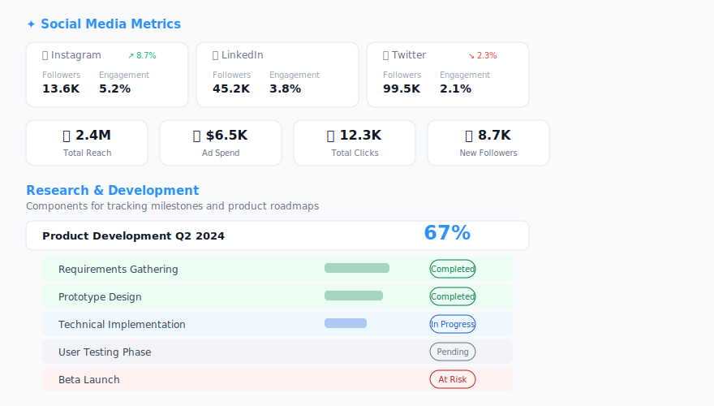

| Component | Description |
|---|---|
| **Social Media Card** | Platform icon + followers + engagement + posts count. Uses `grid grid-cols-3 gap-4` |
| **Aggregate Stat Row** | 4 stat boxes (Total Reach, Ad Spend, Clicks, Followers). Uses `grid grid-cols-4 gap-4` |
| **Product Milestone Timeline** | Progress bar + status badges per step (Completed / In Progress / Pending / At Risk) |
| **Roadmap Card** | Quarter-based cards with key features list + status pills |

---

### Template 2 — Component Showcase

> A documentation/demo page that displays all available chat components in numbered sections. Used as a reference for builders exploring the design kit.

**Variants:** Light, Dark, Blue-tinted, Ant Design themed, shadcn themed

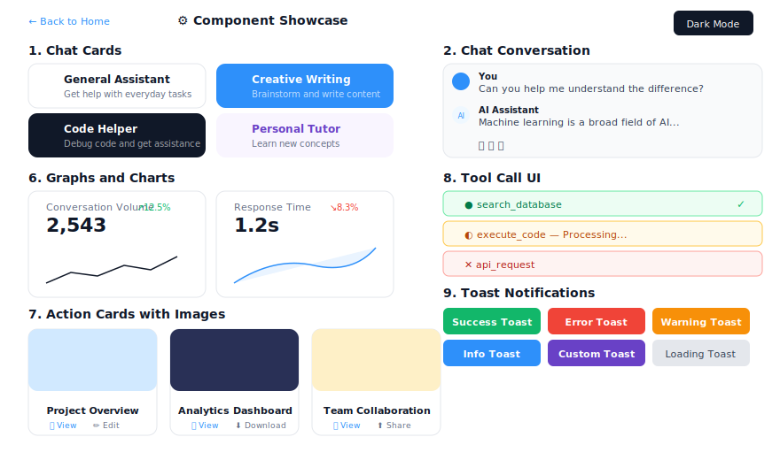

#### Sections Included

| # | Section | What It Shows |
|---|---|---|
| 1 | **Chat Cards** | 4 agent category cards (General Assistant, Creative Writing, Code Helper, Personal Tutor) |
| 2 | **Chat Conversation** | User/AI message bubbles with feedback icons |
| 3 | **Left Sidebar** | Sidebar with chat history + New Chat button |
| 4 | **Top Navigation Bar** | Agent name + search + user profile |
| 5 | **Chat Input** | Text input + attachment/mic/send |
| 6 | **Graphs and Charts** | Conversation Volume, Response Time, Monthly Usage, Category Distribution |
| 7 | **Action Cards with Images** | Image header cards with action buttons (View, Edit, Download, Share) |
| 8 | **Tool Call UI** | Success/processing/error tool status rows |
| 9 | **Toast Notifications** | 6 toast types: Success, Error, Warning, Info, Custom, Loading |

#### Chat Category Cards Pattern

```jsx
{/* Agent category cards — 2x2 grid */}
<div className="grid grid-cols-2 gap-3">
  <div className="flex items-center gap-3 p-4 rounded-xl border border-gray-200 bg-white hover:bg-gray-50">
    <div className="w-10 h-10 rounded-lg bg-gray-100 flex items-center justify-center">
      <ChatIcon className="w-5 h-5 text-gray-600" />
    </div>
    <div>
      <p className="text-sm font-semibold text-gray-900">General Assistant</p>
      <p className="text-xs text-gray-500">Get help with everyday tasks</p>
    </div>
  </div>

  <div className="flex items-center gap-3 p-4 rounded-xl bg-blue-500 text-white">
    <div className="w-10 h-10 rounded-lg bg-white/20 flex items-center justify-center">
      <WriteIcon className="w-5 h-5 text-white" />
    </div>
    <div>
      <p className="text-sm font-semibold">Creative Writing</p>
      <p className="text-xs text-white/70">Brainstorm and write content</p>
    </div>
  </div>
</div>
```

---

### Template 3 — Landing / Marketing Pages

> A hero + feature grid + theme preview page for marketing the AI Chat UI library. Multiple theme variants exist (shadcn, Ant Design, custom Unilever blue).

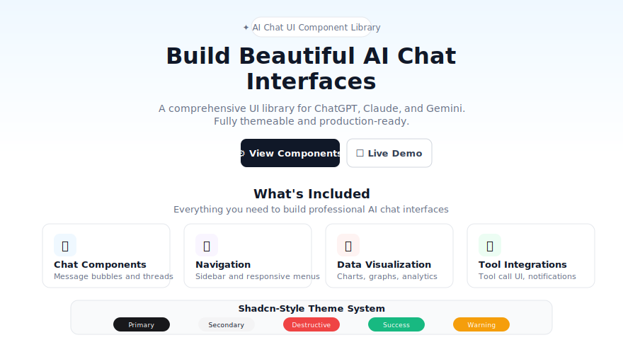

#### Theme Variants Available

| Theme | Primary | Secondary | Accent | Source |
|---|---|---|---|---|
| **shadcn** | `#18181b` | `#F4F4F5` | `#ef4444` | [shadcn/ui](https://ui.shadcn.com) |
| **Ant Design** | `#1677FF` | `#52c41a` | `#faad14` | [Ant Design](https://ant.design) |
| **Custom (Unilever Blue)** | `#005EEF` | `#7179BC` | `#5925DC` | Internal |

#### Key Sections

| Section | Description |
|---|---|
| **Hero** | Badge pill + H1 + subtitle + dual CTA (primary dark + secondary outlined) |
| **Feature Grid** | 4 icon cards: Chat Components, Navigation, Data Visualization, Tool Integrations |
| **Theme Preview** | Color swatches showing the 5 semantic colors with hex codes |
| **CTA Footer** | "Ready to Build?" + Browse Components / View Full Template buttons |

---

### Template 4 — Product Information / INCI Agent

> A structured card for displaying product ingredient data (INCI format). Used in Unilever's regulatory/product information agent workflows.

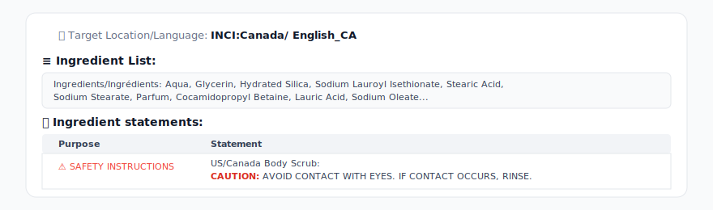

#### Components

| Component | Description |
|---|---|
| **Target Location Header** | Globe icon + location/language label (e.g., INCI:Canada / English_CA) |
| **Ingredient List Block** | Full ingredients text in a bordered container |
| **Ingredient Statements Table** | Purpose + Statement columns, red safety warning formatting |

```jsx
{/* INCI Card */}
<div className="bg-white border border-gray-200 rounded-xl p-6">
  <div className="flex items-center gap-2 mb-4">
    <GlobeIcon className="w-5 h-5 text-gray-400" />
    <span className="text-sm text-gray-500">Target Location/Language:</span>
    <span className="text-sm font-bold text-gray-900">INCI:Canada/ English_CA</span>
  </div>

  <h3 className="text-base font-semibold text-gray-900 mb-2">≡ Ingredient List:</h3>
  <div className="bg-gray-50 border border-gray-200 rounded-lg p-4 text-sm text-gray-700 mb-6">
    {ingredientText}
  </div>

  <h3 className="text-base font-semibold text-gray-900 mb-2">📋 Ingredient statements:</h3>
  <table className="w-full text-sm border border-gray-200 rounded-lg overflow-hidden">
    <thead className="bg-gray-100">
      <tr>
        <th className="px-4 py-2 text-left text-gray-700 font-semibold">Purpose</th>
        <th className="px-4 py-2 text-left text-gray-700 font-semibold">Statement</th>
      </tr>
    </thead>
    <tbody>
      <tr className="border-t border-gray-200">
        <td className="px-4 py-3 text-error-600 font-medium">⚠ SAFETY INSTRUCTIONS</td>
        <td className="px-4 py-3">
          <span className="font-bold text-error-700">CAUTION:</span> AVOID CONTACT WITH EYES.
        </td>
      </tr>
    </tbody>
  </table>
</div>
```

---

### Template 5 — Marketing Chat (Ideas)

> A WIP template group labeled "Marketing Chat - Ideas" in Figma. Contains dark-themed mobile/desktop mockup concepts for a marketing-focused AI chat agent. I was unable to access the detailed child frames due to the Figma file size causing MCP timeouts on nodes past index 24 of the page.

**What's visible from the overview screenshot:**
- Dark-themed UI mockups (similar layout to the Analytics Chat Agent)
- Mobile-responsive card layouts
- Multiple screen variants showing different conversation states

> **⚠️ Note for developers:** The detailed component breakdown for this template group needs to be extracted separately. If you need specifics, open the Figma file and look for frames near the "Marketing Chat - Ideas" title label (node `797:18`) in the lower-center area of the Project Habibi Components page.

---

## Cards (Shared Components)

All templates share a common card component library. These cards are used across every agent interface.

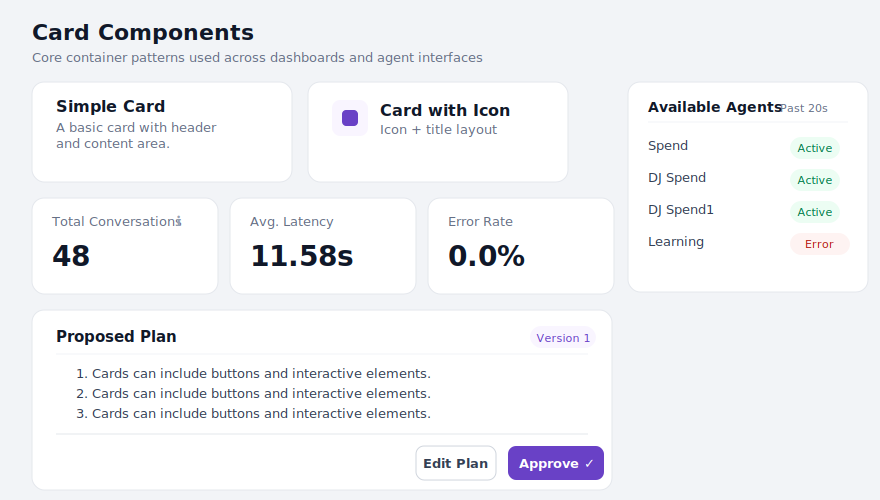

### Card Types

| Type | Description | Used In |
|---|---|---|
| **Simple Card** | Title + description + optional footer | All templates |
| **Card with Icon** | Icon alongside the title row | Showcase, Landing |
| **Stat Card** | Big number + label + optional trend | Chat Agent, Social Media |
| **Proposed Plan** | Numbered summary + approve/reject CTAs | Chat Agent |
| **Agent Card** | Name + status badge per row | Chat Agent |
| **Feedback Card** | Metric row (total, positive, negative, rating) | Chat Agent |
| **Action Card with Image** | Image header + title + action buttons | Showcase |
| **Chat Category Card** | Agent type + description (colored variants) | Showcase |
| **Social Media Card** | Platform stats (followers, engagement, posts) | Chat Agent Extended |
| **INCI Card** | Ingredient list + safety statements | INCI Agent |

### Base Card Structure

```jsx
<div className="bg-white border border-gray-200 rounded-xl shadow-sm">
  {/* Header */}
  <div className="px-6 py-5">
    <h3 className="text-lg font-semibold text-gray-900">Card Title</h3>
    <p className="text-sm text-gray-500 mt-1">Supporting text</p>
  </div>
  {/* Body */}
  <div className="px-6 py-4">{/* content */}</div>
  {/* Footer */}
  <div className="px-6 py-4 border-t border-gray-200 flex justify-end gap-3">
    <button className="...secondaryGray">Cancel</button>
    <button className="...primary">Confirm</button>
  </div>
</div>
```

### Stat Card

```jsx
<div className="bg-white border border-gray-200 rounded-xl p-6">
  <div className="flex items-center justify-between mb-2">
    <span className="text-sm text-gray-500 font-medium">Total Conversations</span>
    <InfoIcon className="w-4 h-4 text-gray-400" />
  </div>
  <span className="text-3xl font-semibold text-gray-900">48</span>
</div>
```

---

## Inputs, Badges & Widgets

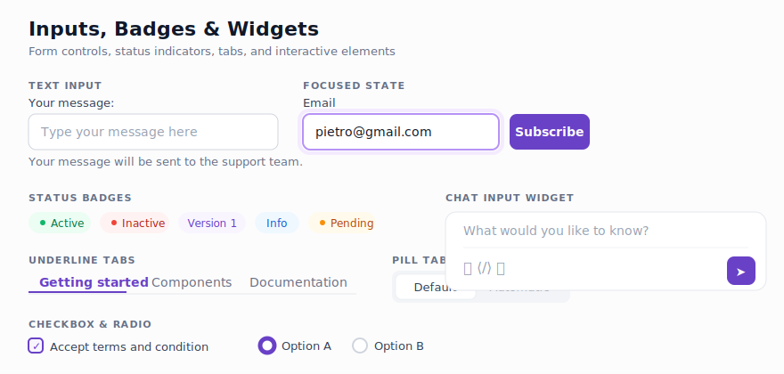

### Text Input

```jsx
<div>
  <label className="block text-sm font-medium text-gray-700 mb-1.5">Your message:</label>
  <input
    type="text"
    placeholder="Type your message here"
    className="w-full px-3.5 py-2.5 border border-gray-300 rounded-lg text-sm
               placeholder-gray-400 focus:border-brand-300 focus:ring-4 focus:ring-brand-100"
  />
  <p className="text-sm text-gray-500 mt-1.5">Helper text goes here.</p>
</div>
```

### Status Badges

```jsx
{/* Success */}
<span className="inline-flex items-center gap-1.5 px-2.5 py-0.5 text-xs font-medium rounded-full bg-success-50 text-success-700">
  <span className="w-1.5 h-1.5 rounded-full bg-success-500" /> Active
</span>

{/* Error */}
<span className="inline-flex items-center gap-1.5 px-2.5 py-0.5 text-xs font-medium rounded-full bg-error-50 text-error-700">
  <span className="w-1.5 h-1.5 rounded-full bg-error-500" /> Inactive
</span>

{/* Info */}
<span className="px-2.5 py-0.5 text-xs font-medium rounded-full bg-brand-50 text-brand-700">
  Version 1
</span>
```

### Tabs

```jsx
{/* Underline Tabs */}
<div className="flex border-b border-gray-200">
  <button className="px-4 py-3 text-sm font-semibold text-brand-600 border-b-2 border-brand-600">
    Getting started
  </button>
  <button className="px-4 py-3 text-sm text-gray-500 hover:text-gray-700">Components</button>
</div>

{/* Pill Tabs */}
<div className="flex gap-1 p-1 bg-gray-100 rounded-lg">
  <button className="px-3 py-1.5 text-sm font-medium bg-white rounded-md shadow-sm">Default</button>
  <button className="px-3 py-1.5 text-sm text-gray-500 rounded-md">Automatic</button>
</div>
```

### Chat Input Widget

```jsx
<div className="bg-white border border-gray-200 rounded-xl">
  <div className="px-4 py-3">
    <input placeholder="What would you like to know?"
           className="w-full text-sm placeholder-gray-400 focus:outline-none" />
  </div>
  <div className="px-4 py-2 border-t border-gray-100 flex items-center gap-3">
    <AttachIcon /><CodeIcon /><MicIcon />
    <div className="flex-1" />
    <button className="bg-brand-600 text-white p-2 rounded-lg"><SendIcon /></button>
  </div>
</div>
```

---

## Modals & Dialogs

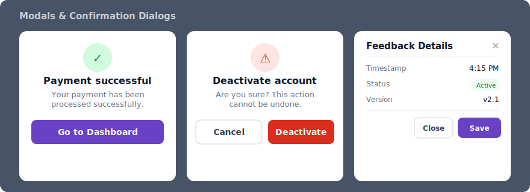

### Modal Types

| Type | Use Case |
|---|---|
| **Success Confirmation** | Payment processed, action completed |
| **Destructive Confirmation** | Delete, deactivate, irreversible actions |
| **Info / Details** | View feedback, inspect record details |
| **Form Modal** | Create test, edit settings |
| **Data Table Modal** | Event distribution, scrollable table |

### Base Modal Structure

```jsx
{/* Backdrop */}
<div className="fixed inset-0 bg-gray-900/60 flex items-center justify-center z-50">
  {/* Container */}
  <div className="bg-white rounded-xl shadow-xl w-full max-w-lg mx-4">
    {/* Header */}
    <div className="px-6 py-5 border-b border-gray-200 flex items-center justify-between">
      <h2 className="text-lg font-semibold text-gray-900">Modal Title</h2>
      <button className="text-gray-400 hover:text-gray-600"><CloseIcon /></button>
    </div>
    {/* Body */}
    <div className="px-6 py-5">{/* content */}</div>
    {/* Footer */}
    <div className="px-6 py-4 border-t border-gray-200 flex justify-end gap-3">
      <Button variant="secondaryGray">Cancel</Button>
      <Button variant="primary">Confirm</Button>
    </div>
  </div>
</div>
```

### Confirmation Dialog Pattern

```jsx
{/* Centered icon + text + actions */}
<div className="bg-white rounded-xl p-6 max-w-sm text-center">
  {/* Icon circle — swap colors for success/destructive */}
  <div className="mx-auto w-12 h-12 bg-success-100 rounded-full flex items-center justify-center mb-4">
    <CheckIcon className="w-6 h-6 text-success-600" />
  </div>
  <h3 className="text-lg font-semibold text-gray-900">Payment successful</h3>
  <p className="text-sm text-gray-500 mt-2">Your payment has been processed.</p>
  <button className="mt-6 w-full bg-brand-600 text-white py-2.5 rounded-lg font-semibold">
    Go to Dashboard
  </button>
</div>
```

---

## Tailwind Config

Drop-in `tailwind.config.js` extension to register all design tokens:

```js
// tailwind.config.js
module.exports = {
  theme: {
    extend: {
      fontFamily: {
        display: ['"Unilever Desire"', 'serif'],
        sans: ['Inter', 'system-ui', 'sans-serif'],
      },
      colors: {
        brand: {
          25: '#FCFAFF', 50: '#F9F5FF', 100: '#F4EBFF', 200: '#E9D7FE',
          300: '#D6BBFB', 400: '#B692F6', 500: '#9E77ED', 600: '#6941C6',
          700: '#7F56D9', 800: '#53389E', 900: '#42307D',
        },
        gray: {
          25: '#FCFCFD', 50: '#F9FAFB', 100: '#F2F4F7', 200: '#E4E7EC',
          300: '#D0D5DD', 400: '#98A2B3', 500: '#667085', 600: '#475467',
          700: '#344054', 800: '#1D2939', 900: '#101828',
        },
        error: {
          25: '#FFFBFA', 50: '#FEF3F2', 100: '#FEE4E2', 200: '#FECDCA',
          300: '#FDA29B', 400: '#F97066', 500: '#F04438', 600: '#D92D20',
          700: '#B42318', 800: '#912018', 900: '#7A271A',
        },
        warning: {
          25: '#FFFCF5', 50: '#FFFAEB', 100: '#FEF0C7', 200: '#FEDF89',
          300: '#FEC84B', 400: '#FDB022', 500: '#F79009', 600: '#DC6803',
          700: '#B54708', 800: '#93370D', 900: '#7A2E0E',
        },
        success: {
          25: '#F6FEF9', 50: '#ECFDF3', 100: '#D1FADF', 200: '#A6F4C5',
          300: '#6CE9A6', 400: '#32D583', 500: '#12B76A', 600: '#039855',
          700: '#027A48', 800: '#05603A', 900: '#054F31',
        },
        bluegray: {
          25: '#FCFCFD', 50: '#F8F9FC', 100: '#EAECF5', 200: '#D5D9EB',
          300: '#AFB5D9', 400: '#717BBC', 500: '#4E5BA6', 600: '#3E4784',
          700: '#363F72', 800: '#293056', 900: '#101323',
        },
        blue: {
          25: '#F5FAFF', 50: '#EFF8FF', 100: '#D1E9FF', 200: '#B2DDFF',
          300: '#84CAFF', 400: '#53B1FD', 500: '#2E90FA', 600: '#1570EF',
          700: '#175CD3', 800: '#1849A9', 900: '#194185',
        },
        purple: {
          25: '#FAFAFF', 50: '#F4F3FF', 100: '#EBE9FE', 200: '#D9D6FE',
          300: '#BDB4FE', 400: '#9B8AFB', 500: '#7A5AF8', 600: '#6938EF',
          700: '#5925DC', 800: '#4A1FB8', 900: '#3E1C96',
        },
      },
      boxShadow: {
        xs: '0px 1px 2px rgba(16, 24, 40, 0.05)',
        sm: '0px 1px 3px rgba(16, 24, 40, 0.1), 0px 1px 2px rgba(16, 24, 40, 0.06)',
        md: '0px 4px 8px -2px rgba(16, 24, 40, 0.1), 0px 2px 4px -2px rgba(16, 24, 40, 0.06)',
        lg: '0px 12px 16px -4px rgba(16, 24, 40, 0.08), 0px 4px 6px -2px rgba(16, 24, 40, 0.03)',
        xl: '0px 20px 24px -4px rgba(16, 24, 40, 0.08), 0px 8px 8px -4px rgba(16, 24, 40, 0.03)',
      },
    },
  },
};
```

---

## Quick Cheat Sheet

| What You Need | Tailwind Classes |
|---|---|
| Primary button | `bg-brand-600 hover:bg-brand-700 text-white px-4 py-2.5 text-sm font-semibold rounded-lg` |
| Secondary button | `bg-white border border-gray-300 text-gray-700 hover:bg-gray-50 px-4 py-2.5 text-sm font-semibold rounded-lg shadow-xs` |
| Destructive button | `bg-error-600 hover:bg-error-700 text-white px-4 py-2.5 text-sm font-semibold rounded-lg` |
| Card container | `bg-white border border-gray-200 rounded-xl shadow-sm` |
| Card padding | `p-6` (24px) |
| Section gap | `space-y-6` or `gap-6` |
| Body text | `text-base text-gray-700 leading-6` |
| Supporting text | `text-sm text-gray-500` |
| Page heading | `text-3xl font-bold text-gray-900` |
| Input field | `w-full px-3.5 py-2.5 border border-gray-300 rounded-lg text-sm focus:ring-4 focus:ring-brand-100 focus:border-brand-300` |
| Badge (success) | `bg-success-50 text-success-700 px-2.5 py-0.5 text-xs font-medium rounded-full` |
| Badge (error) | `bg-error-50 text-error-700 px-2.5 py-0.5 text-xs font-medium rounded-full` |
| Modal overlay | `fixed inset-0 bg-gray-900/60 flex items-center justify-center z-50` |
| Modal container | `bg-white rounded-xl shadow-xl w-full max-w-lg` |

---

*Built for Project Habibi / Nexus — Horizon 3 Labs. For questions, reference the [Figma source file](https://www.figma.com/design/qafioCr7GiesyZtf90byDh/Design-System-2.0?node-id=339-11336).*
